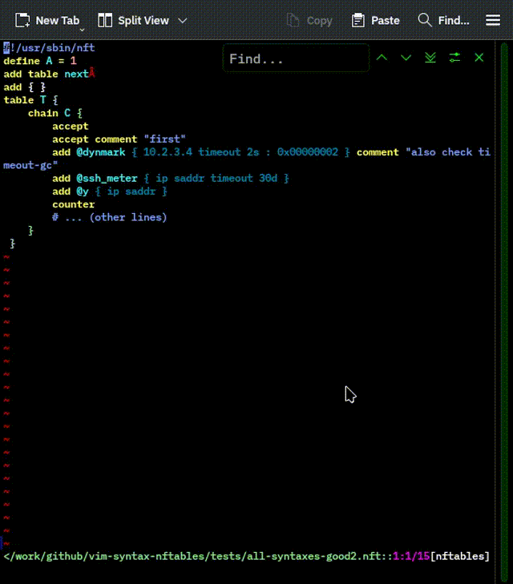

# vim-syntax-nftables

This project adds color highlighting for nftables code in [Vim](https://www.vim.org/) and [Neovim](https://neovim.io/). It helps you see your code better and spot mistakes fast.

**See it in action:**

**What does this do?**
- Highlights important nftables words in color
- Shows mistakes or typos in red
- Works with files that end in `.nft` and scripts that start with `#!nft` (this is called a "shebang", which tells your computer to use nft)
- Works out-of-the-box in Vim and Neovim, with both light and dark color themes

---

## How to Install

Go to [INSTALL.md](https://github.com/egberts/vim-syntax-nftables/blob/master/INSTALL.md) to see step-by-step instructions on how to add this to Vim or Neovim.

---

## How to Use

After you install, you do not need to do anything extra. The colors will show up automatically when you open:
- `/etc/nftables.conf` or `/etc/nftables*.conf`
- Any file that ends with `.nft`
- Scripts that start with `#!nft` at the top

---

## If You Find a Problem

If the colors look wrong or if something does not work:
1. Try to find the shortest line or lines of code that cause the problem.
   - You do not need to share your whole file. Just the line(s) that cause the problem.
   - Cover up any private info, like real IP addresses.
2. Go to [the issues page](https://github.com/egberts/vim-syntax-nftables/issues) and open a new issue. Add:
   - The line(s) that look wrong
   - What you expect to see
   - (Best) Add a screenshot
3. If you need to share more, use a Gist link.

---

## For Developers

If you want to help make this better or fix things, see [DEBUG.md](https://github.com/egberts/vim-syntax-bind-named/blob/master/DEBUG.md) for tips. (Even though it says "bind-named", the tricks work here too.)

### Note about IPv6 address matching

Vim has a limit when matching patterns (only 9 matching groups allowed). To make IPv6 addresses work, the pattern is repeated in the files. This makes it faster and prevents problems. Also, since the code got long (over 12,000 lines), files are now split into smaller parts by what they do. This helps find mistakes faster.

---

## Extra

You can find a picture that explains how nftables works [here (PDF railroad diagram)](https://github.com/egberts/vim-syntax-nftables/blob/df5aa8805419c25122da15b23190b771513bf729/doc/nftables-railroad-chart.xhtml.pdf)
