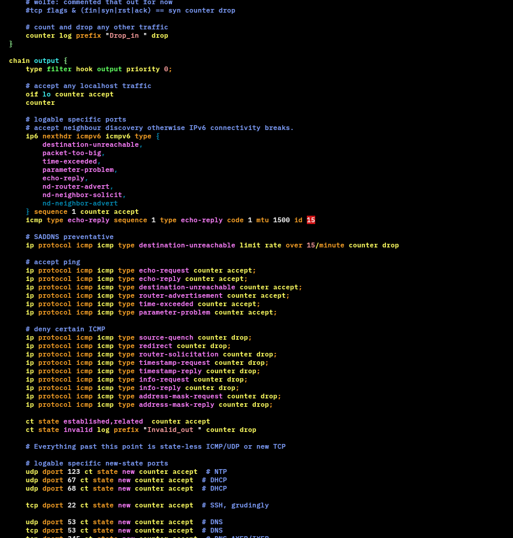
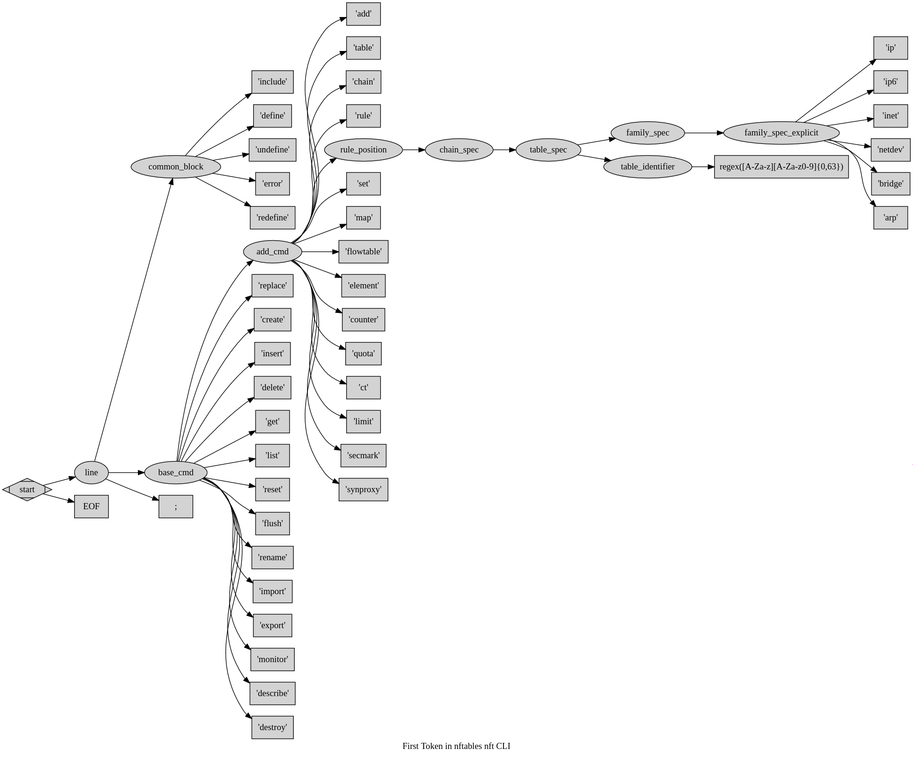

# vim-syntax-nftables

A Vim/Neovim syntax highlighter for [nftables](https://wiki.nftables.org/) configuration and script files.  

It highlights `nft` keywords, catches typos and invalid combinations, and works out-of-the-box with both `.nft` files and `#!nft` shebang scripts.

---

## Features

- Syntax highlighting for `nftables` configuration and script files
- Proactive error highlighting:
  - Invalid combinations and typos are shown in **red**
- Supports both:
  - Files with `.nft` extension
  - Files starting with `#!nft` shebang
- Works with Vim and Neovim
- Tested with dark/light color schemes

---

## Screenshots

Default colorscheme (`:colorscheme default`, `set background=dark`):

Token-level highlighting:

Demo session:

Example animation:

---

## Installation

See [INSTALL.md](https://github.com/egberts/vim-syntax-nftables/blob/master/INSTALL.md) for instructions on installing this syntax file into your local Vim/Neovim setup.

---

## Usage

Once installed, nftables syntax highlighting is automatically enabled for:

- Files ending in `.nft`
- Scripts with a `#!nft` shebang

---

## Bug Reporting

If you run into highlighting issues:

1. Narrow down the problem to the minimal offending line(s).
   - You don’t need to share your entire `nftables.nft`.
   - Please anonymize IP addresses if needed.
2. Open an [issue](https://github.com/egberts/vim-syntax-nftables/issues) and include:
   - The offending line(s)
   - The incorrect highlight
   - What you expect instead
3. You can also use a Gist to share longer snippets or screenshots.

---

## Debugging Vim Syntax

If you’d like to experiment with or debug the syntax file, see [DEBUG.md](https://github.com/egberts/vim-syntax-bind-named/blob/master/DEBUG.md).  
(Although written for `bind-named`, the debugging techniques apply here as well.)

---

## Notes for Vim Developers

While prototyping IPv6 address matching, I discovered a limitation in Vim 8.1:  
- It only supports a maximum of 9 groups of parentheses in regex matches, even when using `\%( … \)` instead of `\( … \)`.  
- To work around this, IPv6 patterns are duplicated in the syntax file. This workaround is faster in practice and avoids breaking matches.

---
